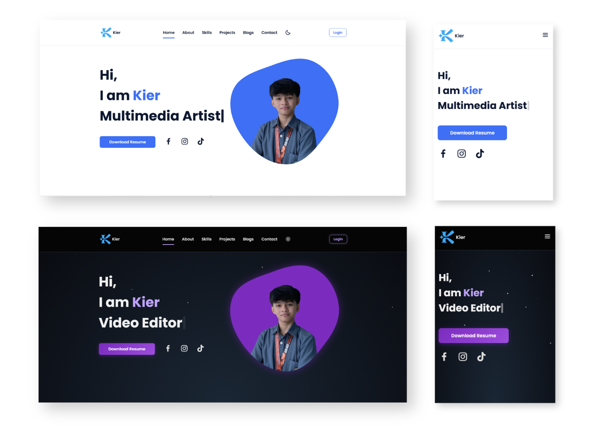

# Vasquez

Kier Vincent B. Vasquez Portfolio

## Website: [https://kierporfolio.web.app](https://kierporfolio.web.app)

### Responsive Personal Portfolio & Blog

A fully responsive personal portfolio website featuring a dynamic blog system, user authentication, and a modern dark/light theme interface.

- **Responsive Design:** Developed with the Mobile First methodology, compatible with all devices.
- **Dark/Light Mode:** Includes a theme switcher for user preference.
- **Dynamic Blog System:** Integrated with Firebase for real-time blog posts and updates.
- **User Authentication:** Login and Register functionality for user interaction.
- **Contact Integration:** Functional contact form powered by **EmailJS**.
- **Smooth Animations:** Features scroll animations using **ScrollReveal** and **Typed.js**.

### Technologies Used
- HTML5, CSS3, JavaScript
- [Firebase](https://firebase.google.com/) (Hosting, Auth, Database)
- [EmailJS](https://www.emailjs.com/) (Contact Form)
- [Boxicons](https://boxicons.com/) (Icons)

